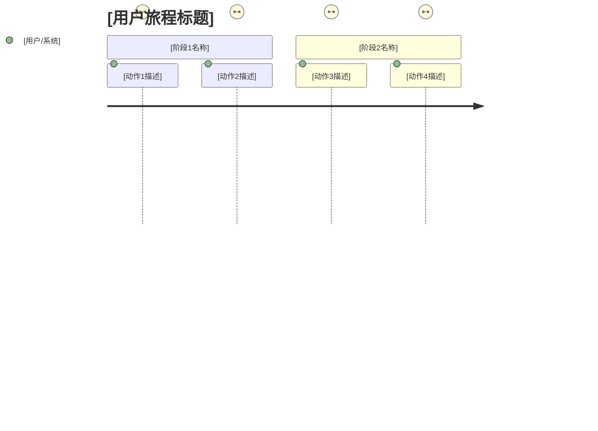
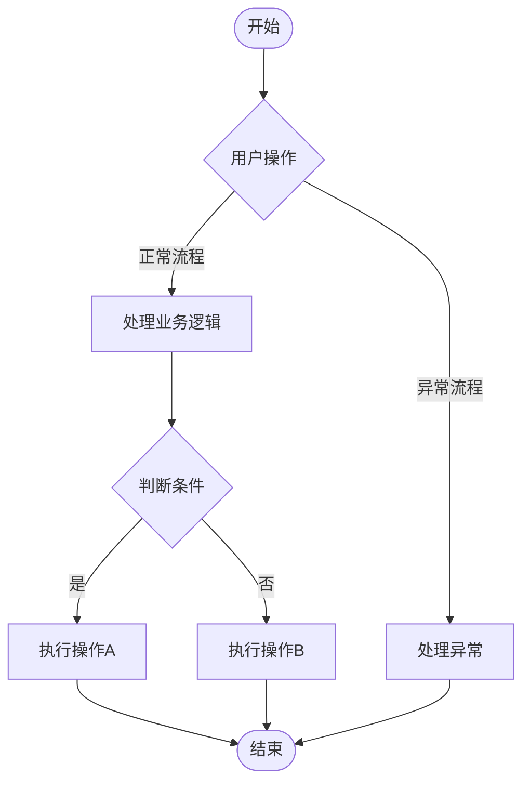

# PRD 模板（中文标准版）

> **版本**：v3.0.0
> **适用场景**：AI 驱动的产品需求文档生成
> **章节结构**：八章标准结构（项目概述 → 用户分析 → 需求详述 → 成功指标 → 验收标准 → 技术约束 → 五方评审 → 附录）
> **优先级体系**：MoSCoW 四级分类（Must / Should / Could / Won't），映射 P0 ~ P2
> **验收标准格式**：Given / When / Then（行为驱动开发格式）
> **指标体系**：Leading 领先指标 + Lagging 滞后指标双轨体系
> **图表支持**：Mermaid 用户旅程图、业务流程图
> **五方评审**：技术可行性、运营影响、商业价值、法律合规

---

## 第一章、项目概述

### 章节说明

本章用于描述项目的背景、目标、范围和核心价值，让读者在 5 分钟内理解「这个产品是什么」「为什么要做」以及「做到什么程度才算成功」。

### 填写说明

- **背景与问题**：描述当前业务中存在的主要痛点，具体到「什么人」「在什么场景下」「遇到了什么问题」。
- **项目目标**：用 SMART 原则定义 3~5 个核心目标，每个目标附带量化指标和目标值。
- **范围定义——包含**：明确列出本次项目要做的工作内容，按功能模块分类。
- **范围定义——不包含**：明确列出本次项目不做但容易被误以为要做的事项。
- **核心价值主张**：用一句话（不超过 50 字）回答「用户为什么需要这个功能」。

### 模板正文

```markdown
# [项目名称]

## 1.1 背景与问题

【描述当前业务中存在的主要痛点】
【具体到：什么人 + 在什么场景下 + 遇到了什么问题】
【用数据说明问题的严重程度和影响范围】

## 1.2 项目目标

| 目标编号 | 目标描述 | 衡量指标 | 目标值 | 数据来源 |
|----------|----------|----------|--------|----------|
| OBJ-001 | 【目标 1 描述】 | 【指标名称】 | 【目标值】 | 【数据来源】 |
| OBJ-002 | 【目标 2 描述】 | 【指标名称】 | 【目标值】 | 【数据来源】 |

## 1.3 范围定义

### 1.3.1 包含范围

- 【功能模块 1】：【一句话描述核心功能】
- 【功能模块 2】：【一句话描述核心功能】

### 1.3.2 不包含范围

- 【明确排除的功能】：【排除原因】
- 【将来可能做但本次不做的功能】：【原因】

## 1.4 核心价值主张

【用一句话（不超过 50 字）概括本产品对目标用户的核心价值】
```

---

## 第二章、用户分析

### 章节说明

本章深入分析目标用户群体，理解他们的角色、目标、行为模式和痛点。

### 用户旅程图



**图表说明**：上图是用户旅程图，评分 1-5 表示用户在该步骤的满意度。完整版 PRD 提供 HTML 附件，可双击直接在浏览器中查看渲染后的图表。

### 填写说明

- **目标用户画像**：为每个用户角色建立完整的画像卡片。
- **用户旅程与需求**：从用户视角梳理从「发现需求」到「任务完成」的完整旅程。
- **用户故事**：使用标准格式「作为 [角色]，我希望 [功能]，以便 [收益]」编写用户故事。

### 模板正文

```markdown
## 2.1 目标用户画像

### 2.1.1 主要用户

| 属性 | 内容 |
|------|------|
| 角色 | 【如：平台付费学员】 |
| 用户背景 | 【日常如何使用产品、在什么场景下遇到问题】 |
| 核心目标 | 【使用这个功能希望达成什么】 |
| 关键痛点 | 【当前流程中遇到的主要障碍和阻力】 |
| 使用频率 | 【如：每月遇到问题时 1~2 次】 |

### 2.1.2 次要用户（可选）

| 属性 | 内容 |
|------|------|
| 角色 | 【如：一线客服专员】 |
| 用户背景 | 【日常工作职责和工作流】 |
| 核心目标 | 【使用这个功能希望提升什么效率】 |
| 关键痛点 | 【当前使用分散渠道处理反馈时遇到的具体问题】 |

## 2.2 用户旅程与需求

### 2.2.1 用户主流程

【从用户视角描述从发现需求到完成任务的完整流程，划分 4~6 个阶段】

- **阶段一【发现】**：用户在使用产品过程中遇到了什么问题
- **阶段二【评估】**：用户决定是否值得花时间反馈
- **阶段三【行动】**：用户找到反馈入口并完成填写
- **阶段四【等待】**：用户等待反馈被处理
- **阶段五【接收】**：用户收到处理结果通知并做出评价

### 2.2.2 各阶段触点与痛点分析

| 阶段 | 触点 | 用户行为 | 核心需求 | 当前痛点 | 设计机会 |
|------|------|----------|----------|----------|----------|
| 【阶段名】 | 【用户接触产品的具体场景】 | 【用户做了什么】 | 【用户真正需要什么】 | 【阻碍用户完成目标的具体障碍】 | 【产品可以如何改善】 |

## 2.3 用户故事

| ID | 角色 | 用户故事（作为…我希望…以便…） | 优先级 | 关联章节 |
|----|------|----------------------------------|--------|----------|
| US-001 | 【角色】 | 作为【角色】，我希望【功能描述】，以便【收益描述】 | P0 | 3.2.1 |
| US-002 | 【角色】 | 作为【角色】，我希望【功能描述】，以便【收益描述】 | P1 | 3.2.2 |
```

---

## 第三章、需求详述

### 业务流程图



**图表说明**：上图是业务流程图，展示了核心功能的操作流程。完整版 PRD 提供 HTML 附件，可双击直接在浏览器中查看渲染后的图表。

### MoSCoW 功能清单

| 功能模块 | 功能名称 | 功能描述 | 优先级 | 备注 |
|----------|----------|----------|--------|------|
| 【模块1】 | 【功能1】 | 【描述】 | P0 / Must | 必须有 |
| 【模块1】 | 【功能2】 | 【描述】 | P1 / Should | 应该有 |
| 【模块2】 | 【功能3】 | 【描述】 | P2 / Could | 可以有 |
| 【模块2】 | 【功能4】 | 【描述】 | Won't | 本次不做 |

### Given/When/Then 验收标准

**验收标准示例**：

```markdown
### 3.2.1 反馈表单提交

**验收标准 1：正常提交反馈**

- **Given**：用户已登录，且在产品使用中
- **When**：用户选择问题类型为「功能异常」，填写描述「提交按钮无法点击」，上传 1 张截图，点击「提交」按钮
- **Then**：系统显示「提交成功」提示，生成反馈编号，弹窗在 3 秒后自动关闭

**验收标准 2：必填项校验**

- **Given**：用户打开反馈表单
- **When**：用户未选择问题类型，直接点击「提交」按钮
- **Then**：系统显示「请选择问题类型」的提示，表单不提交，当前填写内容保留
```

---

## 第四章、成功指标

### 章节说明

本章定义项目的成功指标，包括北极星指标和支撑指标。

### 指标格式

```markdown
## 4.1 北极星指标

| 指标名称 | 定义 | 目标值 | 类型 |
|----------|------|--------|------|
| 【指标1】 | 【定义】 | 【目标值】 | Lagging |
| 【指标2】 | 【定义】 | 【目标值】 | Leading |

## 4.2 支撑指标

| 指标名称 | 定义 | 目标值 | 类型 |
|----------|------|--------|------|
| 【指标3】 | 【定义】 | 【目标值】 | Lagging |
```

---

## 第五章、验收标准

### 章节说明

本章使用 Given/When/Then 格式定义验收标准。

### 模板正文

```markdown
## 5.1 功能验收标准

### 5.1.1 [功能名称]

**验收标准 1：[场景描述]**

- **Given**：【前置条件】
- **When**：【触发动作】
- **Then**：【预期结果】
```

---

## 第六章、技术约束

### 章节说明

本章描述项目的技术约束，包括技术栈、集成依赖、安全合规等。

### 模板正文

```markdown
## 6.1 技术栈

| 类别 | 技术选型 | 说明 |
|------|----------|------|
| 前端 | 【技术】 | 【说明】 |
| 后端 | 【技术】 | 【说明】 |
| 数据库 | 【技术】 | 【说明】 |

## 6.2 集成依赖

| 第三方服务 | 集成方式 | 用途 |
|-----------|----------|------|
| 【服务】 | 【API/SDK】 | 【用途】 |

## 6.3 安全合规

- 【安全要求】
- 【合规要求】
```

---

## 第七章、五方评审（可选）

> **说明**：本章为可选章节，完整模式和标准模式默认包含，快速模式不包含。

### 7.1 技术可行性评审

| 评审项 | 内容 | 风险等级 |
|--------|------|----------|
| 技术难度 | 【评估】 | 【高/中/低】 |
| 实现周期 | 【评估】 | — |
| 技术风险 | 【描述】 | 【高/中/低】 |
| 应对方案 | 【方案】 | — |

### 7.2 运营影响评估

| 评审项 | 内容 | 备注 |
|--------|------|------|
| 运营成本 | 【描述】 | — |
| 人力需求 | 【描述】 | — |
| 上线计划 | 【描述】 | — |
| 影响分析 | 【描述】 | — |

### 7.3 商业价值分析

| 评审项 | 内容 | 备注 |
|--------|------|------|
| ROI | 【描述】 | — |
| 竞品对比 | 【描述】 | — |
| 用户价值 | 【描述】 | — |

### 7.4 法律合规审核

| 评审项 | 内容 | 备注 |
|--------|------|------|
| 数据合规 | 【描述】 | — |
| 隐私政策 | 【描述】 | — |
| 用户协议 | 【描述】 | — |

---

## 第八章、附录

### 术语表

| 术语 | 定义 |
|------|------|
| 【术语1】 | 【定义】 |
| 【术语2】 | 【定义】 |

### 变更记录

| 版本 | 日期 | 变更内容 |
|------|------|---------|
| v0.9 | 【日期】 | 初始版本 |
