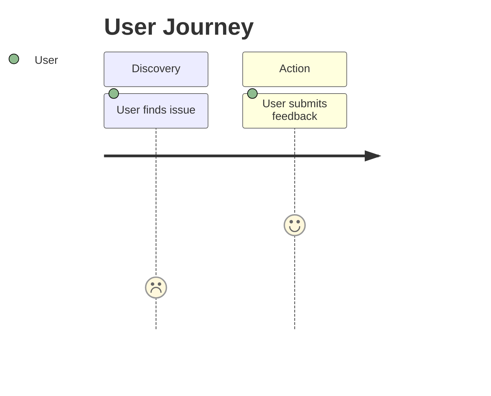
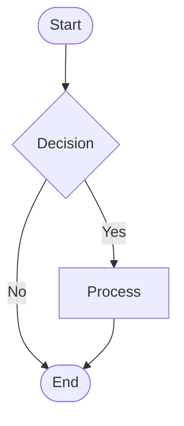

# PRD-Writer

> **Version**: v3.0.0
> A structured PRD generation skill with Mermaid diagrams and Five-Party Review.

## Features

- **Three-Phase Workflow**: Context Gathering → Refinement → Reader Testing
- **Three Modes**: Complete / Standard (Default) / Quick
- **Mermaid Diagrams**: User journey maps and business flow charts
- **HTML Attachments**: Zero-config rendering, double-click to view
- **Five-Party Review**: Technical, Operations, Business, Legal review
- **MoSCoW Priority**: Must / Should / Could / Won't
- **Given/When/Then**: Structured acceptance criteria
- **Bilingual**: Chinese and English templates

## Usage

### Trigger Words

```
写PRD, 做PRD, 生成PRD, PRD写作, 需求文档, 产品需求文档,
完整PRD, 快速PRD, 图表PRD, 可视化PRD, ...
```

### Quick Start

1. Trigger PRD-Writer with any trigger word
2. Select a mode (Complete / Standard / Quick)
3. Answer questions about your product
4. Get a complete PRD with diagrams

### Three Modes

| Mode | Description | Five-Party Review | Diagrams |
|------|-------------|-------------------|----------|
| **Complete** | Most comprehensive | ✅ | ✅ All |
| **Standard** (Default) | Professional PRD | ✅ | ✅ Core |
| **Quick** | MVP minimal | ❌ | Simplified |

### Output

- **Feishu Document**: Full PRD with diagrams
- **HTML Attachment**: Mermaid diagrams (double-click to view)

## Directory Structure

```
prd-writer/
├── SKILL.md                    # Skill definition
├── PRD模板_中文.md             # Chinese template
├── PRD模板_英文.md             # English template
├── README.md                   # This file
├── README_zh.md               # 中文说明
├── 五方评审/                   # Five-party review templates
│   ├── 技术可行性.md
│   ├── 运营影响.md
│   ├── 商业价值.md
│   └── 法律合规.md
├── 图表模板/                   # Mermaid templates
│   ├── 用户旅程图.md
│   └── 业务流程图.md
└── HTML模板/                   # HTML rendering template
    └── mermaid_template.html
```

## Mermaid Diagrams

### User Journey Map



### Business Flow



## Five-Party Review

| Review | Focus |
|--------|-------|
| Technical | Feasibility, complexity, risks |
| Operations | Cost, manpower, launch plan |
| Business | ROI, competition, value |
| Legal | Compliance, privacy, security |

## Requirements

- Mermaid CDN requires internet connection
- Modern browser required (Chrome 80+, Firefox 75+, Safari 14+)

## License

MIT License

---

*Generated with ❤️ by PRD-Writer*
