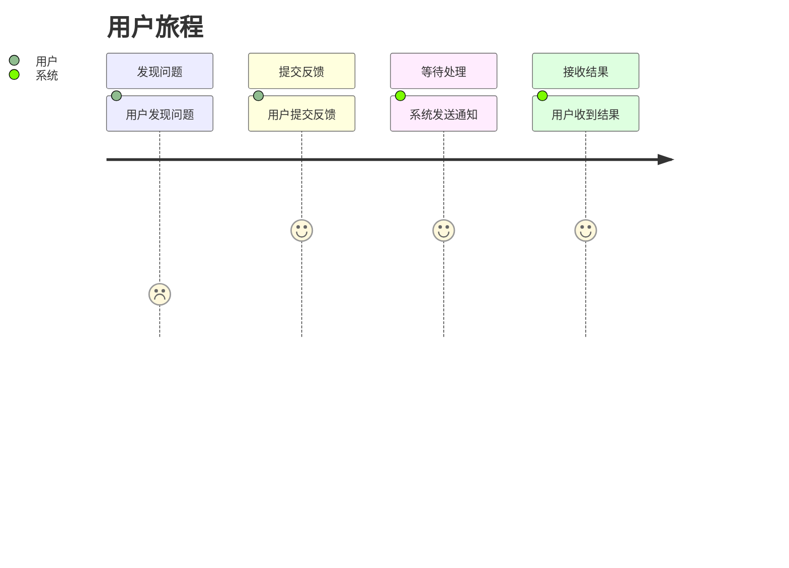
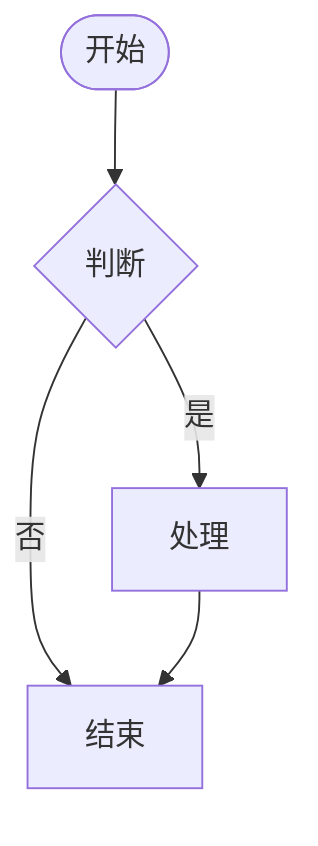

# PRD-Writer 产品需求文档写作助手

> **版本**：v3.0.0
> 基于三阶段工作流 + MoSCoW 优先级结构，支持 Mermaid 图表和五方评审的结构化 PRD 生成技能。

## 核心功能

- **三阶段工作流**：需求收集 → 内容生成 → 可读性验证
- **三档模式**：完整模式 / 标准模式（默认）/ 快速模式
- **Mermaid 图表**：用户旅程图 + 业务流程图
- **HTML 附件**：零配置渲染，双击即看
- **五方评审**：技术可行性 / 运营影响 / 商业价值 / 法律合规
- **MoSCoW 优先级**：Must / Should / Could / Won't
- **Given/When/Then**：结构化验收标准
- **中英双语**：中文和英文模板

## 使用方式

### 触发词

```
写PRD、做PRD、生成PRD、PRD写作、需求文档、产品需求文档、
完整PRD、快速PRD、图表PRD、可视化PRD、...
```

### 快速开始

1. 使用触发词唤醒 PRD-Writer
2. 选择模式（完整 / 标准 / 快速）
3. 回答关于产品的问题
4. 获得完整的 PRD 和图表

### 三档模式对比

| 模式 | 说明 | 五方评审 | 图表 |
|------|------|---------|------|
| **完整模式** | 最全面的 PRD | ✅ | ✅ 全部 |
| **标准模式**（推荐） | 专业标准 PRD | ✅ | ✅ 核心 |
| **快速模式** | MVP 最小可用 | ❌ | 简化 |

### 输出内容

- **飞书云文档**：完整的 PRD 文档，包含图表
- **HTML 附件**：Mermaid 图表渲染文件（双击即看）

## 目录结构

```
prd-writer/
├── SKILL.md                    # 技能定义
├── PRD模板_中文.md             # 中文模板
├── PRD模板_英文.md             # 英文模板
├── README.md                   # 英文说明
├── README_zh.md               # 本文件
├── 五方评审/                   # 五方评审模板
│   ├── 技术可行性.md
│   ├── 运营影响.md
│   ├── 商业价值.md
│   └── 法律合规.md
├── 图表模板/                   # Mermaid 模板
│   ├── 用户旅程图.md
│   └── 业务流程图.md
└── HTML模板/                   # HTML 渲染模板
    └── mermaid_template.html
```

## Mermaid 图表示例

### 用户旅程图



### 业务流程图



## 五方评审

| 评审维度 | 关注点 |
|---------|--------|
| 技术可行性 | 功能实现难度、技术风险 |
| 运营影响 | 运营成本、人力需求 |
| 商业价值 | ROI、竞品对比 |
| 法律合规 | 数据合规、隐私政策 |

## 系统要求

- Mermaid CDN 需要网络连接
- 需要现代浏览器（Chrome 80+、Firefox 75+、Safari 14+）

## 许可证

MIT License

---

*由 PRD-Writer ❤️ 驱动*
