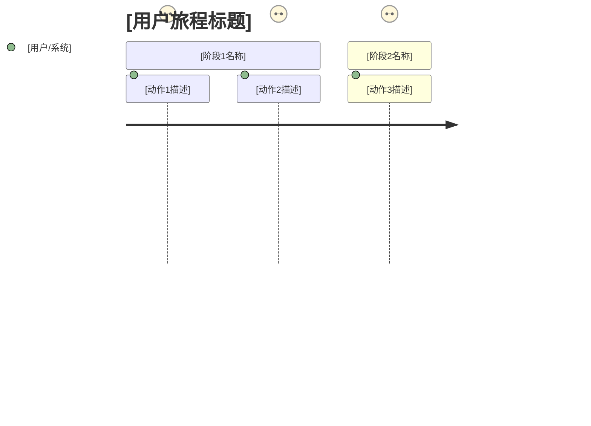
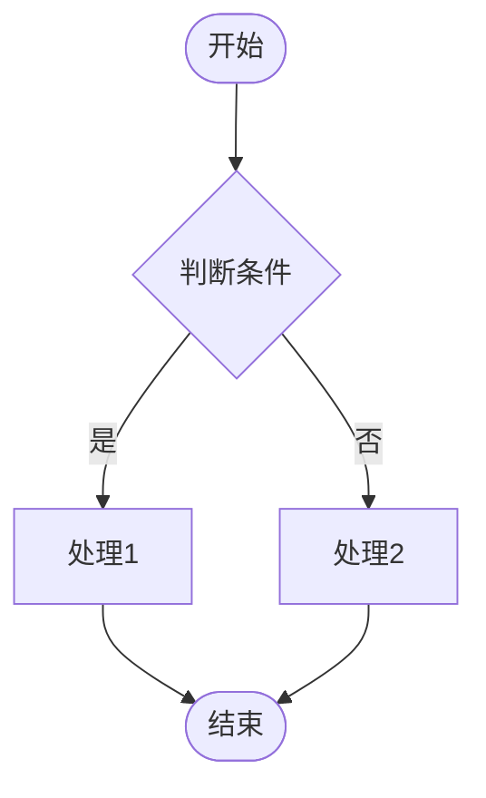

# PRD-Writer Skill

```json
{
  "name": "prd-writer",
  "description": "生成结构化产品需求文档（PRD）的技能，基于三阶段工作流 + MoSCoW 优先级结构，支持 Mermaid 图表和五方评审。适用于从零开始撰写PRD、优化已有PRD、或基于需求文档生成完整PRD。",
  "triggers": [
    "写PRD",
    "做PRD",
    "生成PRD",
    "PRD写作",
    "需求文档",
    "产品需求文档",
    "编写需求文档",
    "prd-writer",
    "产品文档",
    "输出PRD",
    "PRD模板",
    "起草PRD",
    "规划PRD",
    "撰写PRD",
    "整理PRD",
    "功能需求",
    "把需求写成文档",
    "完善PRD",
    "优化PRD",
    "补全PRD",
    "生成产品文档",
    "完整PRD",
    "全面PRD",
    "图表PRD",
    "可视化PRD",
    "快速PRD",
    "简单PRD",
    "MVP PRD"
  ],
  "templates": {
    "zh": "PRD模板_中文.md",
    "en": "PRD模板_英文.md"
  },
  "modules": {
    "five_party_review": "五方评审/",
    "chart_templates": "图表模板/",
    "html_template": "HTML模板/mermaid_template.html"
  }
}
```

---

## 工作模式概览

本技能通过**三阶段工作流**生成结构化 PRD：

| 阶段 | 名称 | 目标 |
|------|------|------|
| 阶段一 | Context Gathering | 模式选择 + 收集并确认需求信息 |
| 阶段二 | Refinement & Structure | 按 PRD 章节结构组织内容，应用 MoSCoW 优先级，生成图表 |
| 阶段三 | Reader Testing | 验证可读性，收集反馈，迭代更新 |

---

## 阶段零：模式选择（第一步）

> **进入条件**：用户触发 PRD-Writer 技能（通过触发词或直接请求）
> **退出条件**：用户确认选择模式，或根据关键词自动推断

### 主动询问模式

当用户触发技能时，首先提供模式选择说明：

```markdown
## PRD 模式选择

请选择您需要的模式：

| 模式 | 说明 | 包含内容 |
|------|------|---------|
| **完整模式** | 最全面的 PRD | 7维度问询 + 五方评审 + 全部图表 |
| **标准模式**（推荐） | 专业标准 PRD | 7维度问询 + 五方评审 + 核心图表 |
| **快速模式** | MVP 最小可用 PRD | 3维度问询 + 简化图表 |

**五方评审**：包含技术可行性、运营影响、商业价值、法律合规四个维度。
**图表**：会生成 Mermaid 用户旅程图和业务流程图，提供 HTML 附件（双击即看）。

请告诉我您选择哪种模式。
```

### 模式推断规则

| 用户输入关键词 | 自动推断模式 |
|---------------|-------------|
| "完整"、"全面" | 完整模式 |
| "写PRD"、"生成PRD"、无关键词 | 标准模式（推荐） |
| "快速"、"简单"、"MVP" | 快速模式 |

### 五方评审开关

- **默认**：完整模式和标准模式都包含五方评审
- **关闭**：用户在任何时候说"不需要五方评审"、"跳过评审"即可关闭
- **重新开启**：用户说"加上五方评审"即可重新开启

---

## 阶段一：Context Gathering（需求收集）

> **进入条件**：用户已选择模式（或自动推断）
> **退出条件**：用户确认「需求收集清单」，关键信息（P0 功能、目标用户、成功指标）均已收集

### 识别输入模式

根据用户输入形式判断当前模式：

| 模式 | 判断依据 | 初始动作 |
|------|---------|---------|
| **模式A** | 用户用自然语言描述需求想法，无现成文档 | 直接进入阶段一，逐一提问收集 |
| **模式B** | 用户粘贴了一段文字（PRD草稿/需求描述/功能列表） | 先分析内容缺口，再针对性提问 |
| **模式C** | 用户提供了飞书文档链接 | 用 `feishu_fetch_doc` 读取，再针对性提问 |

### 收集维度

#### 完整模式 / 标准模式：7维度

| # | 维度 | 对应章节 | 典型问题 |
|---|------|---------|---------|
| 1 | 项目背景与目标 | 项目概述 | 这个产品解决什么问题？目标是什么？ |
| 2 | 目标用户 | 用户分析 | 谁会用这个功能？C端/B端？主要和次要用户？ |
| 3 | 核心功能范围 | 需求详述 | 最核心的3个功能是什么？哪些是必须有的？ |
| 4 | 优先级判断 | 需求详述 | 哪些是必须有（MUST）？哪些可以放下一版？ |
| 5 | 成功指标 | 成功指标 | 希望通过这个功能达成什么可量化的结果？ |
| 6 | 验收标准 | 验收标准 | 怎样算「做好了」？关键场景是什么？ |
| 7 | 技术约束 | 技术约束 | 有没有技术限制？依赖哪些系统或第三方服务？ |

#### 快速模式：3维度

| # | 维度 | 对应章节 | 典型问题 |
|---|------|---------|---------|
| 1 | 项目背景与目标 | 项目概述 | 这个产品解决什么问题？ |
| 2 | 目标用户 | 用户分析 | 谁会用？ |
| 3 | 核心功能范围 | 需求详述 | 最核心的功能是什么？ |

### 需求确认清单

阶段一结束时，向用户输出一份确认清单：

```markdown
## ✅ 需求收集清单

请确认以下信息，我将基于此生成 PRD：

- **模式**：[完整模式 / 标准模式 / 快速模式]
- **项目名称**：[名称]
- **项目背景**：[背景描述]
- **目标用户**：主要用户… / 次要用户…
- **核心功能（P0/Must）**：[功能A]、[功能B]、[功能C]
- **次要功能（P1/Should）**：[功能D]、[功能E]
- **成功指标**：[指标1] ≤ [目标值]，[指标2] ≥ [目标值]
- **五方评审**：[开启 / 已关闭]
- **技术约束**：[无特殊限制 / 列明约束]
- **文档语言**：[中文 / 英文 / 双语]
- **输出方式**：[飞书云文档 + HTML附件 / 其他]

请确认或补充，以上信息将作为 PRD 生成依据。
```

---

## 阶段二：Refinement & Structure（完善与结构化）

> **进入条件**：阶段一「需求收集清单」已获用户确认
> **退出条件**：PRD 章节已完成生成，P0/P1 章节内容完整

### PRD 章节生成顺序与优先级

#### 完整模式 / 标准模式：8章节

| 生成顺序 | 章节 | 优先级 | 说明 |
|---------|------|--------|------|
| 1 | 项目概述 | P0（Must） | 背景、目标、范围边界、价值主张 |
| 2 | 用户分析 | P0（Must） | 用户画像、用户旅程图（Mermaid） |
| 3 | 需求详述 | P0（Must） | 功能清单（MoSCoW）、功能详述、业务流程图（Mermaid） |
| 4 | 成功指标 | P1（Should） | 北极星指标、领先指标、滞后指标 |
| 5 | 验收标准 | P1（Should） | Given/When/Then 格式用例 |
| 6 | 技术约束 | P2（Could） | 技术栈、集成依赖、安全合规 |
| 7 | **五方评审** | P1（Should） | 技术/运营/商业/法务评审（完整/标准模式） |
| 8 | 附录 | P2（Could） | 术语表、版本记录、联系人 |

#### 快速模式：5章节

| 生成顺序 | 章节 | 优先级 | 说明 |
|---------|------|--------|------|
| 1 | 项目概述 | P0（Must） | 背景、目标、范围 |
| 2 | 用户分析 | P0（Must） | 用户画像、简化用户旅程 |
| 3 | 需求详述 | P0（Must） | 核心功能清单（MoSCoW） |
| 4 | 成功指标 | P1（Should） | 核心指标 |
| 5 | 验收标准 | P1（Should） | 简化 Given/When/Then 用例 |

### Mermaid 图表生成

#### 用户旅程图（第二章）



**生成时机**：完整模式、标准模式必生成；快速模式简化处理

#### 业务流程图（第三章）



**生成时机**：完整模式必生成；标准模式生成核心流程；快速模式不生成

### HTML 附件生成

生成独立的 HTML 文件，内嵌 Mermaid CDN，用户双击即看：

```html
<!DOCTYPE html>
<html>
<head>
  <meta charset="utf-8">
  <script src="https://cdn.jsdelivr.net/npm/mermaid@11/dist/mermaid.min.js"></script>
  <style>
    body { margin: 20px; font-family: sans-serif; }
    h1 { color: #333; }
    h2 { color: #555; margin-top: 30px; }
    pre.mermaid { 
      display: flex; 
      justify-content: center;
      margin: 20px 0;
    }
  </style>
</head>
<body>
  <h1>《[项目名称]》图表附件</h1>
  <p>打开本文件即可看到渲染后的图表，无需网络。</p>
  
  <h2>用户旅程图</h2>
  <pre class="mermaid">
    journey
      title [用户旅程标题]
      ...
  </pre>
  
  <h2>业务流程图</h2>
  <pre class="mermaid">
    flowchart TD
      ...
  </pre>
  
  <script>
    mermaid.initialize({ startOnLoad: true });
  </script>
</body>
</html>
```

**输出方式**：作为飞书文档附件提供下载，或提供文件路径

---

## 阶段三：Reader Testing（可读性验证）

> **进入条件**：阶段二 PRD 章节已完成
> **退出条件**：用户确认所有章节内容，或完成至少一轮迭代修订

### 文档结构概览

```markdown
## PRD 生成完成

**项目名称**：《[项目名称] 产品需求文档 v0.9》
**模式**：[完整模式 / 标准模式 / 快速模式]
**文档语言**：[中文 / 英文]
**生成时间**：[时间戳]

### 文档结构

- 第一章 项目概述 ✅ 100%
- 第二章 用户分析 ✅ 100%（含用户旅程图）
- 第三章 需求详述 ✅ 100%（含业务流程图）
- 第四章 成功指标 ✅ 100%
- 第五章 验收标准 ✅ 100%
- 第六章 技术约束 ✅ 100%
- [第七章 五方评审] ✅ 100%（完整/标准模式）
- [第八章 附录] ✅ 100%

### 附件

- 📊 HTML 图表附件：[文件名.html]

### ⚠️ 待确认事项

1. [具体待确认项 1]
2. [具体待确认项 2]

请确认是否有需要调整的方向，我可以针对性更新指定章节。
```

---

## 语言模式

| 模式 | 判断条件 | 模板引用 | 输出语言 |
|------|---------|---------|---------|
| **中文模式** | 用户使用中文描述需求（默认） | `PRD模板_中文.md` | 中文 |
| **英文模式** | 用户使用英文描述需求，或明确要求英文 PRD | `PRD模板_英文.md` | 英文 |
| **双语模式** | 用户明确要求「中英文」或「双语」 | 两份模板 | 同时输出中英文 |

---

## 输入模式处理

### 模式A：用户一句话需求 → 从零生成完整 PRD

**典型对话**：

```
用户：我想做一个用户反馈系统
AI：[识别为模式A，询问模式选择]

我需要了解一些信息来帮你生成完整的 PRD：

1. **目标用户**：这个系统给谁用？（C端用户提交反馈？客服处理反馈？两者都要？）
2. **核心目标**：希望通过这个系统达成什么？（提高处理效率？收集更多反馈？）
3. **范围边界**：有没有时间或技术限制？（几周上线？用现有技术栈？）

请告诉我，我会基于这些信息生成完整的 PRD。
```

### 模式B：用户粘贴待优化 PRD → 分析缺口并完善

```
用户：[粘贴了一段300字的需求描述]
AI：[分析内容后，识别缺口]

我看到了您的需求描述，核心功能已清晰。
以下章节需要补充：
...
```

### 模式C：用户提供飞书文档链接

```
用户：[粘贴了飞书文档链接]
AI：[使用 feishu_fetch_doc 读取文档内容]

我已读取您的文档，以下是需求分析：
...
```

---

## 附录：五方评审模块说明

### 评审维度

| 评审方 | 关注点 | 评审问题示例 |
|--------|--------|-------------|
| 技术 | 可行性、复杂度、风险 | 这个功能技术实现难度如何？需要多久？有什么技术风险？ |
| 运营 | 成本、人力、上线计划 | 上线后运营成本多少？需要多少人维护？ |
| 设计 | UX、一致性、影响 | 对现有交互有什么影响？需要改哪些页面？ |
| 商业 | ROI、竞品、价值 | 投入产出比如何？比竞品强在哪里？ |
| 法务 | 合规、隐私、安全 | 涉及用户数据吗？合规吗？需要用户同意吗？ |

### 五方评审触发

- **完整模式**：默认包含全部五方评审
- **标准模式**：默认包含全部五方评审（可关闭）
- **快速模式**：不包含

### 关闭五方评审

用户说以下任意一句即可关闭：
- "不需要五方评审"
- "跳过评审"
- "简单点"
