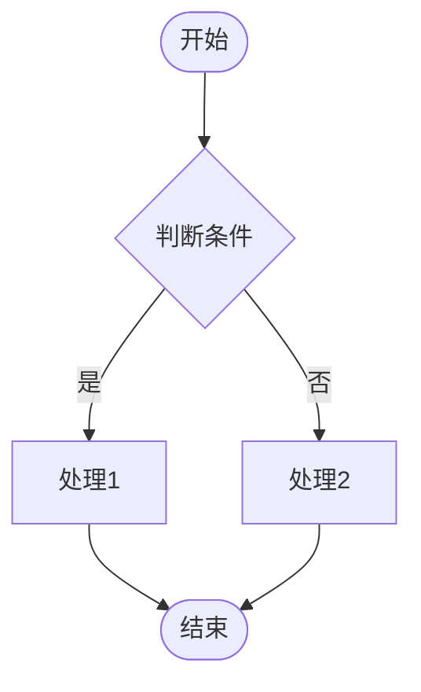
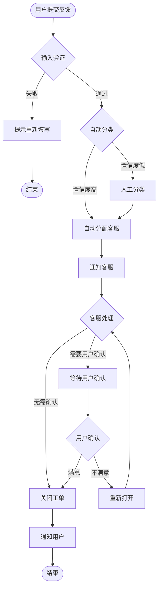
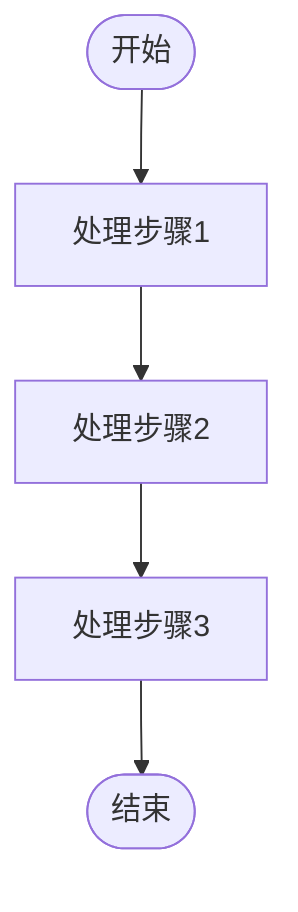
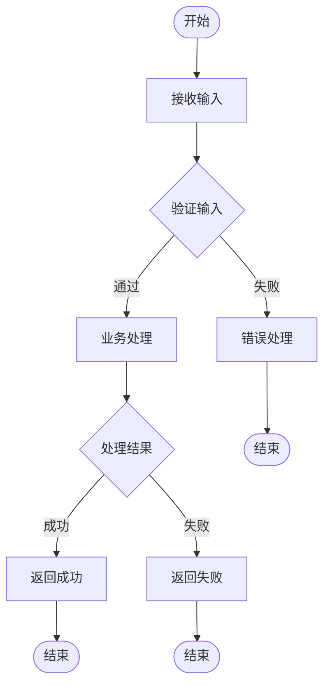

# 业务流程图 Mermaid 模板

> 本模板用于生成 Mermaid 业务流程图（flowchart）。

---

## 基础语法

---

## 节点形状

| 形状 | 语法 | 用途 |
|------|------|------|
| 圆角矩形 | `A([文字])` | 开始/结束节点 |
| 矩形 | `A[文字]` | 普通处理节点 |
| 菱形 | `A{文字}` | 判断/决策节点 |
| 圆形 | `A((文字))` | 连接点/辅助 |
| 六边形 | `A{{文字}}` | 准备/状态 |

---

## 连接线语法

| 语法 | 说明 |
|------|------|
| `A --> B` | 实线箭头 |
| `A --- B` | 实线无箭头 |
| `A -->|文字| B` | 带标签箭头 |
| `A -.-> B` | 虚线箭头 |
| `A ==> B` | 加粗箭头 |

---

## 示例：用户反馈处理流程

---

## 方向语法

| 方向 | 语法 | 说明 |
|------|------|------|
| TD / TB | `flowchart TD` | 从上到下（默认） |
| BT | `flowchart BT` | 从下到上 |
| LR | `flowchart LR` | 从左到右 |
| RL | `flowchart RL` | 从右到左 |

---

## 设计规范

### 节点命名

- 使用有意义的名称，如 `SubmitForm` 而不是 `A`
- 开始节点用 `Start` 或 `A`
- 结束节点用 `End` 或 `Z`
- 判断节点用 `{ }` 包裹

### 连接线标签

- 在判断分支上添加 `|是|`、`|否|` 等标签
- 标签帮助理解流程逻辑

---

## 快速生成模板

### 简单线性流程

### 带判断流程

### 完整业务流程模板

