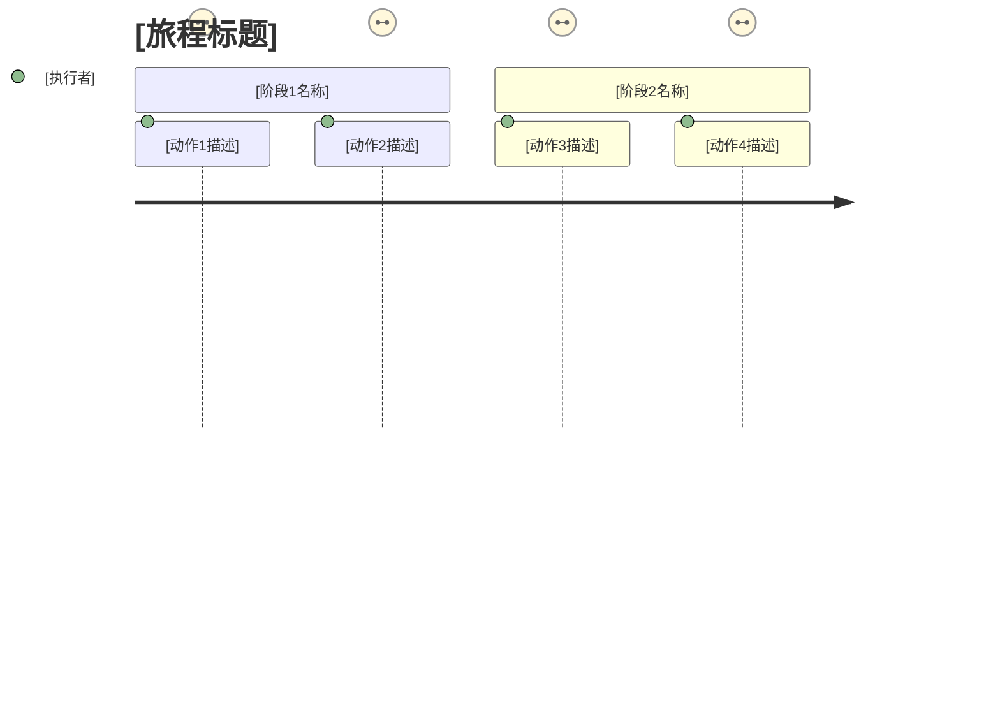
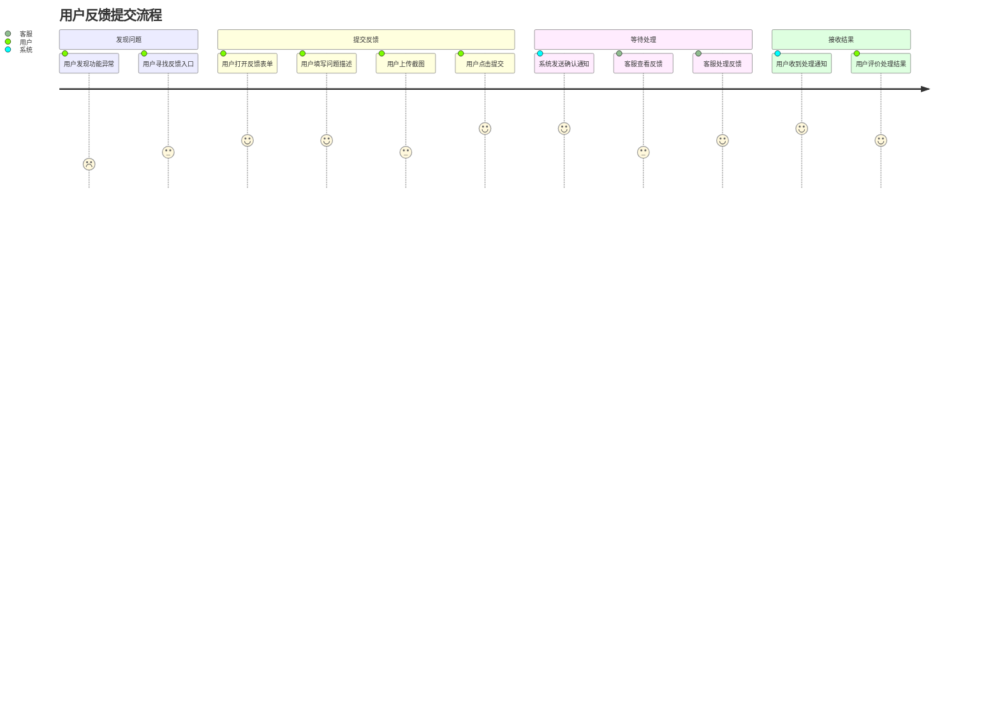
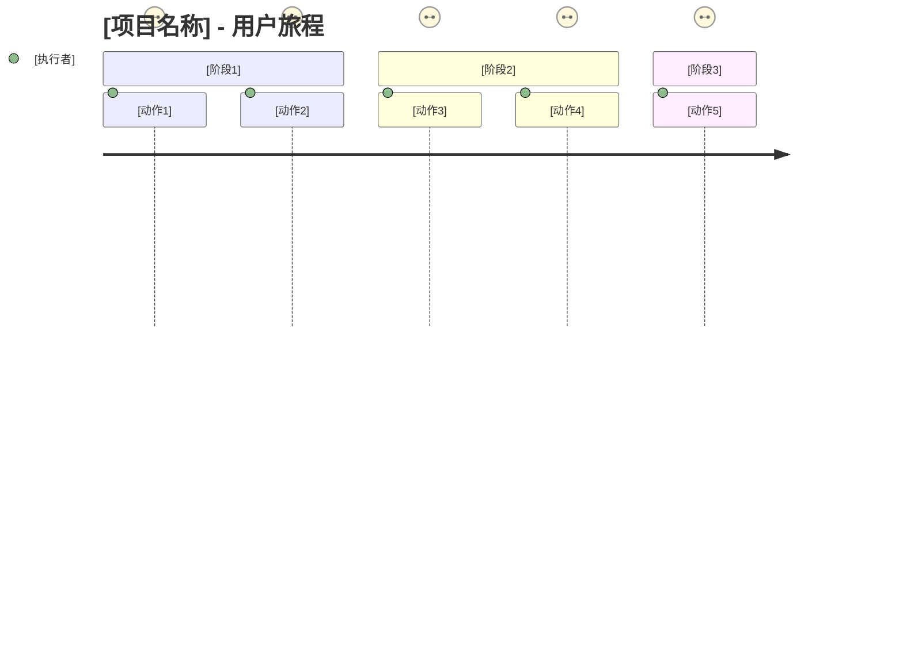

# 用户旅程图 Mermaid 模板

> 本模板用于生成 Mermaid 用户旅程图。

---

## 基础语法

---

## 参数说明

| 参数 | 说明 | 示例 |
|------|------|------|
| title | 旅程标题，显示在图表上方 | 用户反馈提交流程 |
| section | 一个阶段/步骤组 | 发现问题、提交反馈、等待处理 |
| 动作描述 | 用户在该阶段的具体行为 | 填写反馈表单、点击提交按钮 |
| 评分 1-5 | 用户满意度，1最低5最高 | 5 表示非常满意 |
| 执行者 | 用户或系统 | 用户、客服、系统 |

---

## 示例：用户反馈流程

---

## 设计规范

### 评分规则

| 评分 | 含义 | 适用场景 |
|------|------|---------|
| 1 | 非常不满意 | 遇到严重障碍，无法完成任务 |
| 2 | 不满意 | 体验很差，有明显痛点 |
| 3 | 一般 | 可以完成任务，但有不便 |
| 4 | 满意 | 体验较好，完成顺利 |
| 5 | 非常满意 | 体验极佳，超出预期 |

### Section 划分建议

- 每个用户旅程建议 3-6 个 section
- 每个 section 包含 2-4 个动作
- Section 按时间顺序排列

---

## 快速生成模板

当收集到用户旅程信息后，可直接替换以下模板：

